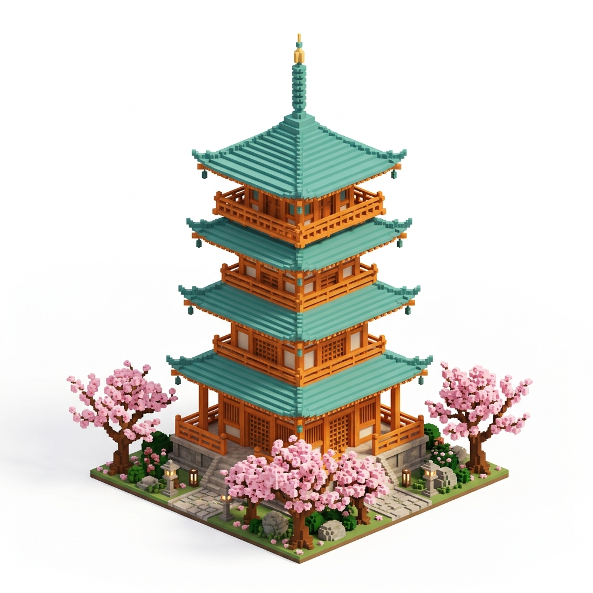

# 禅塔 (Zen Pagoda)

## 项目简介
**禅塔 (Zen Pagoda)** 是一款基于 **Three.js** 开发的网页端单文件 3D 动作探索游戏。
游戏采用极简低多边形（Low-Poly）与体素（Voxel）混搭的美术风格，色调以低饱和度的樱花粉、原木橙和深绿为主，构建了一个充满禅意与战斗爽快感的微型日式箱庭世界。

## 游戏特色
- **三大互通箱庭地图**：包含“樱庭宝塔”、“古风街道”与“枯山水道场”三个通过红木跨海大桥互通的浮空岛屿。
- **智能敌人AI**：敌人不再是无脑的一拥而上。它们会在场景中随机游荡，并在战斗时对玩家进行“包围网”走位，最多允许数名敌人同时发起进攻，呈现出更真实的剑戟对决感。
- **丰富的战斗与收集**：
  - 左键发动**三段式连招攻击**。
  - 右键蓄力释放**旋风斩**。
  - F键消耗满能量释放**全屏终极剑气**。
  - 击败敌人或破坏场景中的陶罐、木桩，有几率掉落能够恢复生命（HP）或积攒能量（Energy）的灵力宝珠，靠近即可自动吸附拾取。
- **自由的移动系统**：支持跳跃与在半空中的自由飞行（长按空格键升空，Q键下降），可在立体的宝塔内部或桥梁之间自由穿行。

## 操作说明
| 按键 / 操作 | 功能描述 |
| :--- | :--- |
| **W A S D** / **方向键** | 移动角色 |
| **Shift** | 疾跑 |
| **Space (空格)** | 跳跃 / 长按进行飞行升空 |
| **Q** | 飞行时下降 |
| **鼠标拖拽** | 旋转视角 |
| **鼠标滚轮** | 缩放视角远近 |
| **鼠标左键** | 普通攻击（三段连招） |
| **E** / **鼠标右键** | 闪避翻滚 / 蓄力旋斩 |
| **F** | 释放终极剑气（需满能量） |
| **H** | 显示 / 隐藏界面 UI |

## 运行方法
本项目为纯前端单文件项目，包含所有的代码逻辑、着色器与材质定义。
1. 直接用任意现代浏览器（Chrome / Edge / Firefox）打开 `index.html` 即可运行。
2. 建议全屏体验，感受最佳的氛围与微光影效果。

## 技术栈
- HTML5 / CSS3 / Vanilla JavaScript
- [Three.js](https://threejs.org/) (用于 3D 渲染与基础数学库)
- 自建轻量级 3D AABB 物理碰撞系统与状态机 AI。
